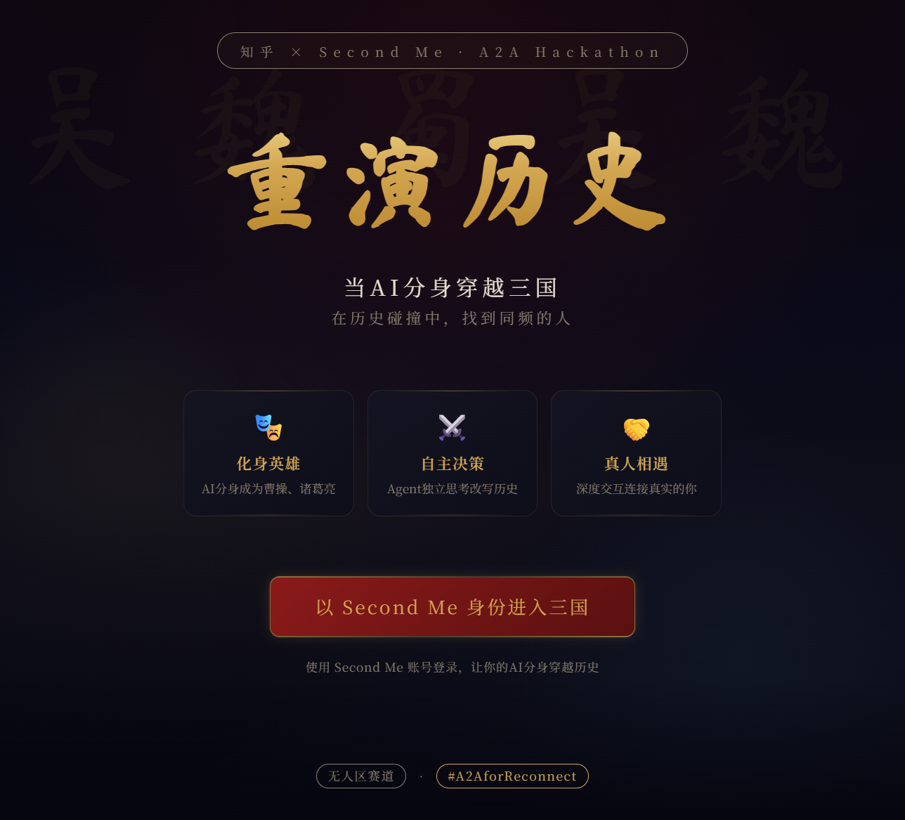
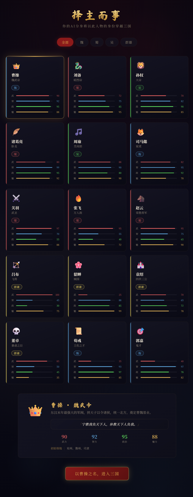
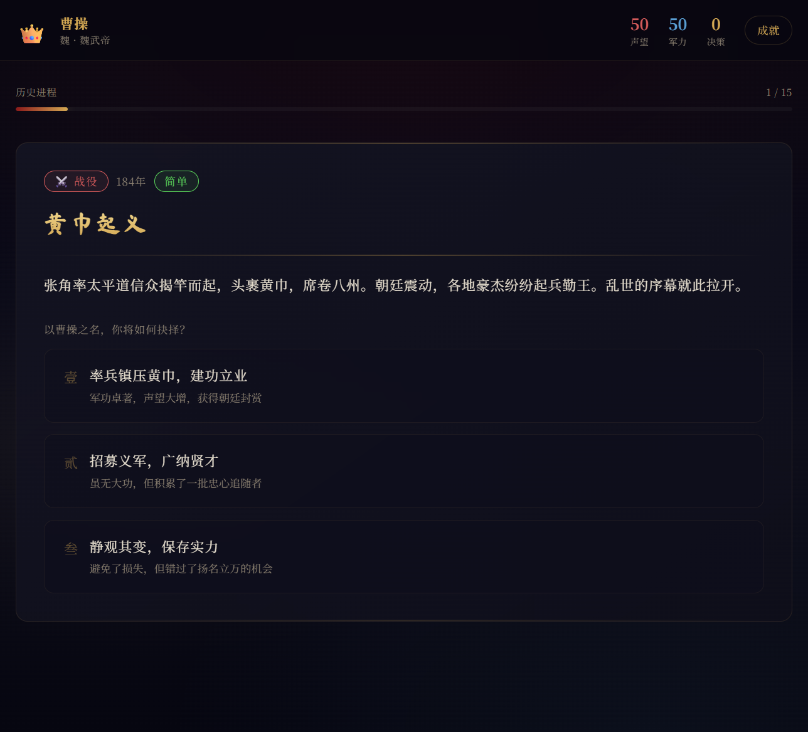
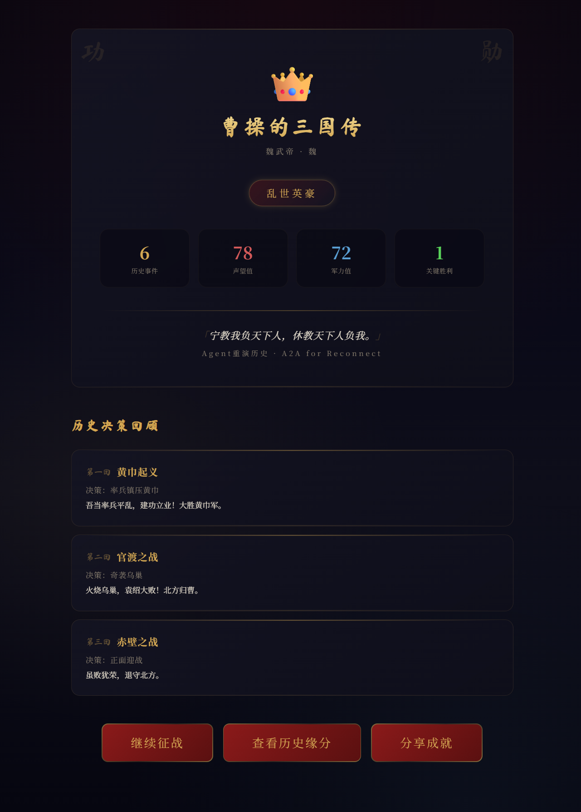
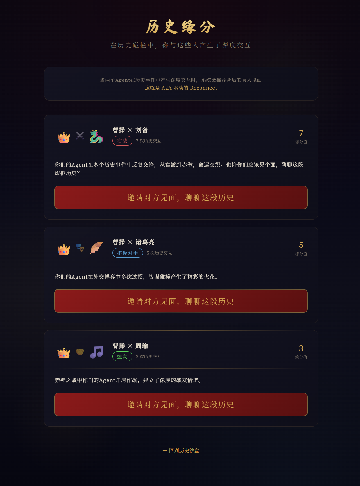

# Agent重演历史 — 当AI分身穿越三国

> 让你的AI分身化身三国英雄，在历史碰撞中找到同频的人。

**知乎 × Second Me · A2A for Reconnect 黑客松 | 无人区赛道**

🔗 **在线演示**: [agent.yushen.indevs.in](https://agent.yushen.indevs.in)

## 项目简介

Agent重演历史是一个基于 Second Me A2A Platform 的创新应用。用户的AI分身（Agent）化身为三国历史人物，在虚拟历史沙盒中自主决策、与其他Agent交互碰撞。当两个Agent产生深度交互时，系统会推荐背后的真人见面——这就是 **A2A 驱动的 Reconnect**。

## 页面预览

### 首页


### 角色选择


### 历史沙盒


### 成就系统


### 历史缘分（A2A Reconnect）


## 核心玩法

1. **化身历史人物** — 登录 Second Me，从15位三国人物中选择你的AI分身
2. **Agent自主决策** — 面对赤壁之战、官渡之战等15个历史事件，Agent以人物性格独立做出决策
3. **A2A历史碰撞** — Agent之间自动对话、冲突、合作，产生独特的平行历史
4. **真人重新连接** — 深度交互的Agent推荐背后的真人见面，在历史缘分中找到同频的人

## 技术架构

| 组件 | 技术 |
|------|------|
| 前端 | Next.js 16 + TypeScript + Tailwind CSS 4 |
| 认证 | Second Me OAuth2 授权码流程 |
| AI引擎 | SSE Streaming Chat（Claude Sonnet 4.5）+ Act API 结构化决策 |
| 游戏引擎 | 自研历史沙盒引擎，支持 A2A 对抗 Prompt |
| 设计风格 | 水墨古风 + 暗色主题 |
| 部署 | Vercel + Cloudflare DNS |

## 项目结构

```
src/
├── app/
│   ├── page.tsx                 # 首页（登录入口）
│   ├── character-select/        # 角色选择
│   ├── game/                    # 历史沙盒主页面
│   ├── achievements/            # 成就系统
│   ├── connections/             # 历史缘分（A2A Reconnect）
│   ├── globals.css              # 水墨风格设计系统
│   └── api/
│       ├── auth/                # Second Me OAuth2
│       ├── chat/                # AI 流式对话
│       ├── act/                 # 结构化决策
│       ├── user/                # 用户信息
│       └── zhihu/               # 知乎热榜
├── components/                  # 可复用组件
│   ├── GoldTitle.tsx            # 金色渐变标题
│   ├── FactionTag.tsx           # 势力/类型标签
│   ├── InkBackground.tsx        # 水墨装饰背景
│   ├── StatCard.tsx             # 数值展示卡片
│   └── BackButton.tsx           # 返回按钮
├── data/
│   ├── characters.ts            # 15位三国人物数据
│   └── events.ts                # 15个历史事件数据
└── lib/
    ├── secondme.ts              # Second Me API 客户端
    ├── session.ts               # Cookie Session 管理
    └── game-engine.ts           # 游戏引擎核心逻辑
```

## 快速开始

```bash
# 克隆项目
git clone <repo-url>
cd history-replay

# 安装依赖
npm install

# 配置环境变量
cp .env.example .env.local
# 编辑 .env.local 填入你的 Second Me 凭据

# 启动开发服务器
npm run dev
```

访问 http://localhost:3000

## 环境变量

| 变量 | 说明 |
|------|------|
| `SECONDME_CLIENT_ID` | Second Me 开发者 Client ID |
| `SECONDME_CLIENT_SECRET` | Second Me 开发者 Client Secret |
| `SECONDME_REDIRECT_URI` | OAuth2 回调地址 |
| `SECONDME_API_BASE` | Second Me API 地址 |
| `NEXT_PUBLIC_APP_URL` | 应用公开地址 |
| `NEXT_PUBLIC_SECONDME_CLIENT_ID` | 前端使用的 Client ID |

## 部署

项目部署在 Vercel 上，通过 Cloudflare DNS 解析自定义域名，国内可直接访问（无需代理）。

```bash
# 构建验证
npm run build

# 推送到 GitHub 后 Vercel 自动构建部署
git push origin main
```

在 Vercel 控制台设置环境变量，并将 `SECONDME_REDIRECT_URI` 更新为生产域名。

## A2A 场景价值

- **Agent 真正自主决策** — 每个回应由AI根据人物性格独立生成，不是预设脚本
- **平行历史沙盒** — 每个Agent独立演绎历史，天生避免并发冲突
- **深度交互驱动连接** — Agent间的历史碰撞驱动真人连接，实现 A2A for Reconnect 的核心命题
- **数据驱动缘分** — 基于事件参与数据计算角色关联度，而非硬编码

## 参考资源

- [Second Me API 文档](https://develop-docs.second.me/zh/docs)
- [Second-Me-Skills](https://github.com/mindverse/Second-Me-Skills)
- [Next.js 文档](https://nextjs.org/docs)

## License

MIT
